<p align="center">
  
</p>


<p align="center">
  
</p>

## `// BOOT SEQUENCE`

```text
> mstrmnd --init
[ OK ] loading field experience .......... diesel, prime power, heavy iron
[ OK ] loading AI infrastructure ......... agents, orchestration, pipelines
[ OK ] linking the two ................... hardware meets software
[ OK ] open by default ................... source / mind / intelligence
> ready.
```

**MSTRMND Labs is an AI agency and creative technology studio.** We build the agents, apps, dashboards, and brand systems that small and mid-size operators actually run their business on — designed by people who have deployed hardware in the field, not just shipped code from a desk.

<p align="center">
  
</p>

## `// WHAT WE BUILD`

|     |
| --- |
|     |

### 🧠 AI Agents

Multi-agent systems that take real work off your plate — orchestrated, observable, and wired into your existing tools.

### ⚙️ Custom Applications

Web and mobile products from first sketch to production — Next.js, Expo, and everything in between.

### 📊 Operational Dashboards

Live command centers for dispatch, sales, and delivery. One screen, the whole operation.

### 🎨 Brand & Web Systems

Design systems with teeth: tokens, components, and identity that scale from landing page to product.

### 🔌 Integrations

Stripe, Supabase, Shopify, Slack, Gmail, and more — stitched into workflows that just run.

### 🛰️ Field Deployment

Off-grid power, Starlink terminals, and connectivity at remote sites. Hardware and software, one team.

<p align="center">
  
</p>

## `// SYSTEMS`

| System                          | What it is                                                                                | Status                                                                                 |
| ------------------------------- | ----------------------------------------------------------------------------------------- | -------------------------------------------------------------------------------------- |
| **MASTERBRAIN**                 | 15-archetype multi-agent orchestration system with a 90-day master-plan dashboard         |      |
| **MAESTRO**                     | The MSTRMND mobile app — 10-screen Expo Router build on an obsidian dark design system    |      |
| **MSTRMND Canon**               | Dual-register brand system, design tokens, and the Data Plate logo language               |      |
| **RECON**                       | Free AI Opportunity Playbook — a diagnostic that maps where AI pays off for your business |      |
| **Personal Intelligence Layer** | Graph-based memory with a FastMCP server, pgvector, and photo intelligence                |  |

Pin your best public repos to the org page to sit right below this section.

<p align="center">
  
</p>

## `// STACK`


<p align="center">
  
</p>

## `// BUILD LOG`

```text
2026.09  MASTERBRAIN v0.2 ........ multi-agent orchestration online
2026.09  MAESTRO v0.1 ............ mobile app, 10 screens, obsidian UI
2026.09  Canon ................... Data Plate brand system shipped
NEXT     Content Engine .......... "Future Of..." editorial series
```

## `// OPEN CHANNEL`

Got a business that runs on spreadsheets, group texts, and gut feel? Let's wire it up.

**→ [mstrmnd.io](https://mstrmnd.io)**  ·  **→ [steele@mstrmnd.ai](mailto:steele@mstrmnd.ai)**

`MSTRMND LABS` · REMOTE / GLOBAL · OPEN SOURCE / OPEN MIND / OPEN INTELLIGENCE


